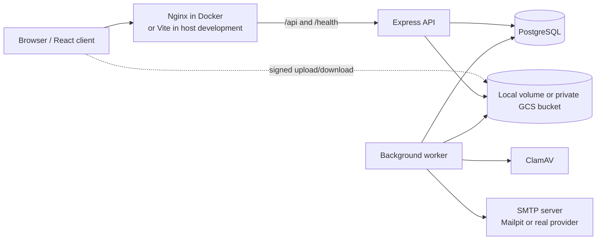
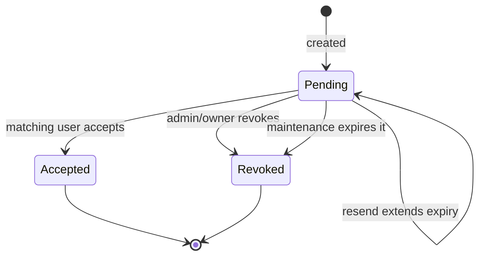
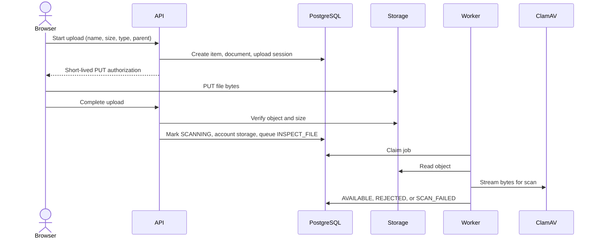
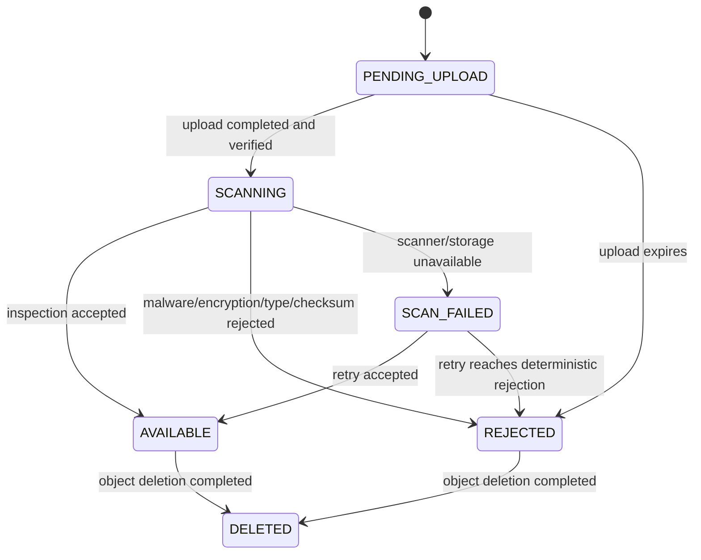

# TeamShelf System Design 

# Agent working on this repository: Chatgpt/Codex 5.6 Sol

## 1. Document purpose

This document is the technical source of truth for the current TeamShelf implementation. It explains what the product does, how its components communicate, where state is stored, how authorization works, how the main workflows execute, and which limitations are intentional.

The repository's `README.md` is the operational quick-start guide. This document focuses on architecture and system behavior. When this document and an older product specification differ, the current source code and this document describe the implemented behavior.

Last reviewed: 2026-09-21.

## 2. Product overview

TeamShelf is an invite-only document workspace application. A registered user can belong to multiple workspaces, organize documents in folders, upload files, share individual documents through expiring public links, and recover recently deleted content.

TeamShelf has two independent permission scopes:

- Platform administration controls who may have a TeamShelf account and who is a platform administrator.
- Workspace ownership controls membership and lifecycle for one workspace.

A platform administrator does not automatically have access to every workspace, and a workspace owner is not automatically a platform administrator.

### Implemented capabilities

- Password and Google authentication.
- PostgreSQL-backed, revocable sessions.
- Invite-only creation of new platform accounts.
- Platform user and administrator management.
- Multiple workspaces per user.
- One owner and multiple members per workspace.
- Existing-user-only workspace invitations.
- Folder and document tree navigation.
- Direct or signed file uploads using local storage or Google Cloud Storage.
- Asynchronous malware, encryption, checksum, and MIME inspection.
- Expiring anonymous share links for individual documents.
- Soft deletion, restoration, retention, and asynchronous object deletion.
- SMTP invitation and password-reset delivery.
- PostgreSQL-backed background jobs and outbox records.
- Structured request, application, worker, and error logging.

### Deliberate MVP exclusions

- Public registration.
- Multiple workspace owners.
- Workspace roles such as viewer or editor.
- Per-folder or per-document member permissions.
- Guest workspace memberships.
- Folder sharing.
- Permanent or password-protected share links.
- Document versioning or file replacement.
- Chunked and resumable uploads.
- Comments, full-text search, and real-time collaboration.
- Office-document editing or preview.
- Redis, Kafka, or a separate queue service.
- Automated CI or deployment from GitHub. Docker artifacts are built and run manually.

## 3. Architecture summary

TeamShelf is a modular monolith with a React frontend and two Node.js runtime entry points. The API and worker share the same domain modules, repositories, configuration, and backend image, but run as independent processes.



### Why a modular monolith

The domain is small enough to deploy as one backend codebase, while authentication, invitations, workspaces, items, documents, users, and jobs remain separated by capability. This avoids distributed-system complexity without putting all business rules into routes or database hooks.

### Primary design patterns

- **Thin HTTP routes:** validate input, invoke one service, and map its result to an HTTP response.
- **Application services:** own business rules and transaction boundaries.
- **Business-oriented repositories:** contain Sequelize queries; services do not query models directly.
- **Ports and adapters:** storage, SMTP, Google identity, password hashing, token generation, file inspection, and time are replaceable dependencies.
- **Composition root:** `app/src/bootstrap/container.js` constructs and connects repositories, adapters, policies, and services.
- **Transactional work creation:** business state and its email/job/outbox follow-up are inserted in the same PostgreSQL transaction where implemented.

## 4. Repository structure

```text
teamshelf/
├── app/                         Backend workspace: @teamshelf/app
│   ├── migrations/              Consolidated PostgreSQL migration
│   └── src/
│       ├── bootstrap/           Dependency construction and runtime factories
│       ├── commands/            Initial admin and recovery commands
│       ├── common/              Errors, HTTP middleware, logging, tokens
│       ├── config/              Convict schema and .env loading
│       ├── infrastructure/      PostgreSQL, SMTP, GCS/local storage, Google, ClamAV
│       ├── modules/             Business services and repositories
│       ├── api-server.js        HTTP process entry point
│       └── worker-server.js     Worker process entry point
├── web/                         React workspace: @teamshelf/web
│   ├── src/components/          Shared UI components
│   ├── src/features/            Route-level product features
│   ├── src/lib/api.js           Same-origin API client
│   ├── src/app.jsx              Browser route map
│   └── nginx.conf               Production static server and API proxy
├── packages/contracts/          Shared workspace: @teamshelf/contracts
├── docker-compose.yml           Local container topology
├── .env.example                 Complete configuration template
├── README.md                    Setup and operations guide
└── design.md                    This document
```

The `packages` directory is retained because `@teamshelf/contracts` is consumed by both the backend and frontend. It holds shared Zod validation schemas, constants, and normalization rules; it is not an unused generic package layer.

## 5. Runtime and deployment model

### Application processes

| Process  | Entry point                  | Responsibility                                                           |
| -------- | ---------------------------- | ------------------------------------------------------------------------ |
| Frontend | Nginx serving the Vite build | Static React application and reverse proxy                               |
| Backend  | `app/src/api-server.js`      | HTTP API, authentication, authorization, synchronous business operations |
| Worker   | `app/src/worker-server.js`   | Email, file inspection, deletion, maintenance, and outbox processing     |

### Images and containers

There are **two custom application images**, not three:

1. `teamshelf-web:local` contains the compiled React application and Nginx.
2. `teamshelf-backend:local` contains the shared backend code and is reused by the backend, worker, migration, and seed containers.

With the scanning profile, Compose normally has six long-running containers and two one-shot containers:

| Container  | Image source       | Lifecycle                        | Purpose                                       |
| ---------- | ------------------ | -------------------------------- | --------------------------------------------- |
| `web`      | TeamShelf frontend | Long-running                     | UI and reverse proxy                          |
| `backend`  | TeamShelf backend  | Long-running                     | Express API                                   |
| `worker`   | TeamShelf backend  | Long-running                     | Background processing                         |
| `postgres` | PostgreSQL 16      | Long-running                     | Durable application state                     |
| `mailpit`  | Mailpit            | Long-running                     | Optional local SMTP capture                   |
| `clamav`   | ClamAV             | Long-running, profile-controlled | Malware scanning                              |
| `migrate`  | TeamShelf backend  | One-shot                         | Applies pending migrations                    |
| `seed`     | TeamShelf backend  | One-shot                         | Creates or verifies the initial administrator |

Mailpit can remain running when real SMTP is configured; it is then unused. ClamAV is operationally required for successful uploads because inspection fails closed when the scanner is unavailable.

### Startup order

```text
PostgreSQL healthy
    -> migrate exits successfully
    -> seed exits successfully
    -> backend and worker start
    -> backend healthy
    -> web starts
```

### Network exposure

- Nginx exposes the web application on `WEB_HOST_PORT`, normally `8080`.
- The API host port, PostgreSQL, Mailpit, and ClamAV bind to `127.0.0.1` by default.
- The backend listens on `0.0.0.0` inside its container so Docker networking can reach it.
- Host development normally binds the backend to `127.0.0.1`.
- `TRUST_PROXY=1` is used in Compose because Nginx is the one trusted proxy hop. Host development uses `0`.

## 6. Frontend architecture

The frontend is a React single-page application using React Router, TanStack Query, React Hook Form, Zod, and a small shared CSS/UI system.

### Browser routes

| Route                                      | Access           | Purpose                                                         |
| ------------------------------------------ | ---------------- | --------------------------------------------------------------- |
| `/login`                                   | Public           | Password or Google sign-in                                      |
| `/invite`                                  | Public           | Platform, workspace, or recovery invitation acceptance          |
| `/forgot-password`                         | Public           | Password reset request                                          |
| `/reset-password`                          | Public           | Password reset completion                                       |
| `/s/:token`                                | Public           | Anonymous single-document share page                            |
| `/workspaces`                              | Authenticated    | Workspace selector and creation                                 |
| `/admin`                                   | Platform admin   | Platform users and invitations                                  |
| `/workspaces/:workspaceId`                 | Workspace member | Root document browser                                           |
| `/workspaces/:workspaceId/folders/:itemId` | Workspace member | Folder browser                                                  |
| `/workspaces/:workspaceId/members`         | Workspace member | Members; owner-only invitation controls                         |
| `/workspaces/:workspaceId/trash`           | Workspace member | Deleted items and restore controls                              |
| `/workspaces/:workspaceId/settings`        | Workspace member | Workspace settings; mutations remain owner-protected by the API |

### Server state and client state

- TanStack Query owns fetched server state and cache invalidation.
- React component state owns transient form, modal, selected-tab, and upload-progress state.
- The session token is never stored in JavaScript-accessible storage. It is an HTTP-only cookie.
- The current CSRF token is returned by the session/login response and held in module memory by `web/src/lib/api.js`.
- Session/user data is cached in TanStack Query and is recovered with `GET /auth/session` after a page reload.
- Invitation tokens are read once from the query string, temporarily placed in `sessionStorage`, and removed from the visible browser address.
- No authentication state is stored in `localStorage`.

### API communication

The browser uses native `fetch`, not Axios. A small wrapper is sufficient for this API and handles:

- Relative `/api/v1` URLs.
- Cookie credentials.
- JSON serialization.
- CSRF headers for mutations.
- Standard response and error envelopes.

There is no frontend backend-URL setting. In Docker, Nginx proxies `/api` and `/health` to `backend:4000`. In host development, Vite proxies those paths to `localhost:4000`. This same-origin design simplifies cookies, CORS, and environment switching.

## 7. Backend layering

An HTTP request follows this path:

```text
Express middleware
  -> route schema validation
  -> authentication/role middleware
  -> application service
  -> policy checks
  -> repository/adapters
  -> PostgreSQL or external infrastructure
  -> standard response envelope
```

### Routes

`api.routes.js` owns URL mapping, Zod validation, response status codes, and application-event logging. It must not contain persistence logic.

### Services

Services implement use cases and explicit managed transactions:

- `AuthService`
- `UserService`
- `WorkspaceService`
- `InvitationService`
- `ItemService`
- `DocumentService`
- `WorkerService`
- `BootstrapAdminService`

### Policies

`WorkspacePolicy` centralizes member, owner, content-editor, and share-manager rules. The API remains authoritative even when the UI hides a control.

### Repositories

Repositories are capability-specific and are the only application layer that queries Sequelize models. Raw SQL is used where PostgreSQL-specific behavior is important, such as recursive item traversal and `FOR UPDATE SKIP LOCKED` job claiming.

### Infrastructure adapters

| Concern                        | Adapter                       |
| ------------------------------ | ----------------------------- |
| Password hashing               | `Argon2PasswordHasher`        |
| Google ID-token verification   | `GoogleIdentityAdapter`       |
| Local file storage             | `LocalFileStorageAdapter`     |
| Cloud storage                  | `GcsFileStorageAdapter`       |
| SMTP                           | `SmtpMailAdapter`             |
| Malware and content inspection | `ClamAvFileInspectionAdapter` |
| Tokens and UUIDs               | `CryptoTokenGenerator`        |
| Time                           | `SystemClock`                 |

## 8. Identity, roles, and authorization

### Identity types

A user may have one or more authentication identities:

- `PASSWORD`: Argon2id password hash.
- `GOOGLE`: Google's stable `sub` identifier and verified email.

Google sign-in uses Google Identity Services popup mode. The browser receives an ID token, sends it to the backend, and the backend verifies its signature, audience, expiry, and verified email using `google-auth-library`. The current flow does not use an OAuth redirect URI or client secret.

### Permission matrix

| Capability                          | Anonymous | Platform user | Workspace member | Workspace owner |         Platform admin |
| ----------------------------------- | --------: | ------------: | ---------------: | --------------: | ---------------------: |
| Open one valid public document link |       Yes |           Yes |              Yes |             Yes |                    Yes |
| Create a new workspace              |        No |           Yes |              Yes |             Yes |                    Yes |
| List workspace content              |        No |            No |              Yes |             Yes |  Only if also a member |
| Upload or create folders            |        No |            No |              Yes |             Yes |  Only if also a member |
| Rename/move/trash own content       |        No |            No |              Yes |             Yes |  Only if also a member |
| Manage any workspace content        |        No |            No |               No |             Yes | Only if also the owner |
| List workspace members              |        No |            No |              Yes |             Yes |  Only if also a member |
| Invite/remove workspace members     |        No |            No |               No |             Yes | Only if also the owner |
| Transfer workspace ownership        |        No |            No |               No |             Yes | Only if also the owner |
| Permanently delete trash            |        No |            No |               No |             Yes | Only if also the owner |
| Invite new platform accounts        |        No |            No |               No |              No |                    Yes |
| Promote/demote platform admins      |        No |            No |               No |              No |                    Yes |

### Important invariants

- A platform invitation always creates a regular `USER`. Promotion happens later from the admin Users tab.
- The last active platform administrator cannot be demoted.
- A workspace has exactly one owner.
- The owner is also represented by a workspace membership.
- Ownership can be transferred only to an existing workspace member.
- The owner cannot be removed as a member until ownership is transferred.
- Workspace invitations can target only an existing, active TeamShelf user who is not already a member.
- Workspace membership is checked on every private workspace operation.
- A missing membership generally produces a generic workspace-not-found response to reduce workspace enumeration.
- Removing a member revokes all of that user's active TeamShelf sessions and all share links they created in that workspace. Session revocation is currently global, not workspace-specific.

## 9. Authentication and session design

### Password login

1. Normalize and validate the email.
2. Load the user and password identity.
3. Verify the password with Argon2id.
4. Require the user status to be `ACTIVE`.
5. Create a random opaque session token and CSRF token.
6. Store only the SHA-256 session-token hash in PostgreSQL.
7. Return the raw session token only as the HTTP-only cookie.

Argon2id parameters are currently 19,456 KiB memory, two iterations, and parallelism one. Passwords must contain at least 12 characters.

### Google login

- A user with an existing Google identity may sign in directly.
- An existing TeamShelf user may sign in with a verified Google email even if the Google identity has not previously been linked; the identity is linked during the transaction.
- A completely new user requires a valid platform or bootstrap invitation.
- A Google email must match the invitation email.
- A Google sign-in can accept a workspace invitation only for an already-existing active account.

### Session storage

The client receives a cookie with these properties:

```text
HttpOnly
SameSite=Lax
Path=/
Secure=true only when NODE_ENV=production
Max-Age=SESSION_TTL_DAYS
```

The database stores the session UUID, user UUID, token hash, CSRF token, expiry, last-seen time, creation time, and optional revocation time. Disabled users and revoked or expired sessions do not authenticate.

### CSRF

Authenticated state-changing requests must include the session-bound `X-CSRF-Token`. The server compares it in constant time. Public unauthenticated mutations, such as login and invitation acceptance, are protected by validation and rate limiting rather than session CSRF.

### Logout and reset

- Logout revokes the current database session and clears the cookie.
- A password reset token is random, stored only as a hash, valid for one hour, and single-use.
- A successful password reset revokes every active session for that user.
- Password-reset requests always return a generic success message, whether or not the email exists.

## 10. Invitation model

TeamShelf has three invitation types:

| Type                 | Created by         | Target                                   | Result                                       |
| -------------------- | ------------------ | ---------------------------------------- | -------------------------------------------- |
| Platform invitation  | Platform admin UI  | Email with no existing TeamShelf account | Creates a regular platform user              |
| Workspace invitation | Workspace owner UI | Existing active TeamShelf user           | Adds workspace membership                    |
| Bootstrap invitation | Operator command   | Recovery email                           | Creates or promotes a platform administrator |

### Link representation

- Platform and workspace links use a versioned HMAC-signed token containing the invitation type and UUID.
- The signature is domain-separated and uses `SESSION_SECRET` as the current signing key.
- Acceptance resolves only an active, non-revoked, non-expired database row.
- Because the link is deterministic, authorized admin/owner list responses can reconstruct it after refresh and display a Copy button.
- A hash is also stored for compatibility with older opaque invitation links.
- Bootstrap recovery invitations remain opaque random tokens stored only as hashes.

Changing `SESSION_SECRET` invalidates outstanding signed platform and workspace invitation URLs as well as other HMAC authorizations using that secret.

### Invitation lifecycle



### Platform onboarding sequence

```mermaid
sequenceDiagram
  actor Admin
  participant API
  participant DB as PostgreSQL
  participant Worker
  participant SMTP
  actor Invitee

  Admin->>API: Create platform invitation
  API->>DB: Invitation + email + SEND_EMAIL job (transaction)
  Worker->>DB: Claim job
  Worker->>SMTP: Send invitation
  Invitee->>API: Accept with password or Google token
  API->>DB: Create USER + identity + session; accept invitation (transaction)
  Admin->>API: Optional Make admin
```

### Workspace onboarding sequence

1. The platform account must already exist and be active.
2. The workspace owner enters that account's email.
3. The API rejects unknown users, disabled users, existing members, and duplicate pending invitations.
4. The worker emails the signed link.
5. The matching existing user authenticates or proves their existing password through the invitation flow.
6. Acceptance creates the membership and marks the invitation accepted in one transaction.

## 11. Workspace and content model

Each workspace has one root item. Folders and documents are stored in one adjacency-list tree called `workspace_items`.

### Item rules

- Item types are `ROOT`, `FOLDER`, and `DOCUMENT`.
- A root has no parent; folders and documents require a parent.
- Only root and folder items can contain children.
- Active sibling names are unique after Unicode normalization and case folding.
- `/`, control characters, empty names, and names over 255 characters are rejected.
- Moving a folder into itself or one of its descendants is prohibited.
- The root cannot be renamed, moved, or deleted.
- Rename and move use `lock_version` optimistic concurrency; stale updates return `409`.
- Moving or renaming a document changes PostgreSQL metadata only. Its storage object key does not change.

### Content permissions

- Every member can see every active item and download every available document in the workspace.
- Any member can create folders and upload files.
- A member can rename, move, trash, restore, or share content they created.
- The owner can manage all content in the workspace.

## 12. Upload and document processing

### Upload sequence



### Validation before upload

- Authenticated workspace membership.
- Parent is an active root or folder.
- Filename rules and active sibling uniqueness.
- Declared MIME type is in `ALLOWED_MIME_TYPES`.
- File size is within `MAX_FILE_SIZE_MB`.
- Projected workspace usage is within `WORKSPACE_STORAGE_LIMIT_GB`.

### Object keys

User filenames are never object keys. The format is:

```text
workspaces/{workspaceId}/documents/{documentId}/{randomId}
```

### Inspection

The worker:

1. Optionally verifies a supplied SHA-256 checksum.
2. Sends bytes to ClamAV using the INSTREAM protocol.
3. Detects PDF, PNG, JPEG, WebP, plain text, CSV, DOCX, XLSX, or PPTX from content.
4. Detects encrypted PDF and encrypted Office packages.
5. Rejects malware, encryption, unknown content, and disallowed detected MIME types.
6. Marks the document `AVAILABLE` only when all checks pass.
7. Marks it `SCAN_FAILED` and retries when inspection infrastructure is unavailable.

### Document state machine



Only `AVAILABLE` documents can be downloaded or shared. `UPLOADED` exists in the shared status constants but is not used by the current transition path.

### Storage providers

**Local storage** uses a private filesystem directory and HMAC-signed application URLs. Upload writes are create-only, path traversal is rejected, and authorization is short-lived.

**Google Cloud Storage** uses a private bucket and V4 signed URLs. The adapter returns provider-neutral authorization objects and never exposes GCS SDK objects to business services.

## 13. Public sharing

A share link grants anonymous access to exactly one available document.

- The token has 256 bits of randomness and only its SHA-256 hash is stored.
- Expiry is bounded by `SHARE_LINK_MAX_EXPIRY_DAYS`, currently 30 days.
- Links can be independently revoked.
- Access count and last-accessed time are recorded.
- Creating, listing, or revoking links requires creator-or-owner permission for the document item.
- Renaming or moving a document does not break its links.
- Trashing the document makes it inaccessible because share lookup requires an active document item.
- Restoring content does not reactivate a link explicitly revoked elsewhere.
- Public responses do not reveal workspace identity.
- Invalid, expired, and revoked links return the same generic unavailable behavior.
- Public endpoints send `Referrer-Policy: no-referrer` and `X-Robots-Tag: noindex, nofollow`.

`allowDownload=false` suppresses access for non-previewable types. For browser-previewable content, a signed content URL is still provided; once a browser can render bytes, absolute prevention of saving those bytes is not technically possible.

## 14. Trash, retention, and workspace deletion

### Item deletion

Deletion is initially soft:

- A subtree receives `deleted_at`, `deleted_by`, and one `deletion_batch_id`.
- The batch allows the subtree to be restored together.
- Restore requires the original parent to be available or part of the same deletion batch.
- Restore fails if an active sibling now occupies the same normalized name.
- Members can restore their own content; the owner can restore any content.
- Only the owner can request permanent deletion.

Permanent deletion queues `DELETE_OBJECT` jobs for documents. After the object is removed, the document becomes `DELETED` and workspace storage usage is decremented. Soft-deleted metadata is retained for traceability.

### Automatic retention

Every five minutes while idle, the worker schedules deletion for document objects whose item has remained in trash beyond `TRASH_RETENTION_DAYS`.

### Workspace deletion

- Only the owner can schedule deletion.
- Scheduling sets `PENDING_DELETION` with a date 30 days in the future.
- The owner may cancel before the due date.
- Maintenance soft-deletes all items, revokes share links, queues object deletion, and marks the workspace `DELETED` when due.

## 15. Background worker

The worker polls PostgreSQL and drains available jobs before waiting for `JOB_POLL_INTERVAL_MS`.

### Job types

| Job             | Effect                                                    |
| --------------- | --------------------------------------------------------- |
| `SEND_EMAIL`    | Renders a versioned template and sends through SMTP       |
| `INSPECT_FILE`  | Verifies checksum, malware, encryption, and detected MIME |
| `DELETE_OBJECT` | Deletes storage bytes and updates document/quota state    |

### Claiming and retry

- Claims are transactional and use `FOR UPDATE SKIP LOCKED`.
- Multiple workers can safely claim different jobs.
- A `PROCESSING` job with a lock older than `JOB_LOCK_TIMEOUT_SECONDS` can be reclaimed.
- Attempts increment on claim.
- Failures use exponential retry delay, capped at one hour.
- A job becomes `FAILED` after `JOB_MAX_ATTEMPTS`.
- SMTP attempts are recorded separately for operational history.
- After SMTP accepts a message, sensitive template data is replaced with a non-sensitive marker.

### Maintenance work

At most once every five minutes, an idle worker:

- Revokes expired workspace, platform, and bootstrap invitations.
- Revokes expired public links.
- Expires abandoned upload sessions and queues object cleanup.
- Completes due workspace deletions.
- Queues deletion for documents beyond trash retention.
- Processes pending outbox records.

The current outbox processor marks local events processed and logs them. It does not publish to Kafka or another external broker.

## 16. Email design

Email is asynchronous. API transactions insert an `email_messages` row and a `SEND_EMAIL` job; the worker performs SMTP delivery.

Implemented templates:

- Platform invitation.
- Workspace invitation and resend.
- Bootstrap administrator recovery invitation.
- Password reset.

The database records SMTP acceptance and attempts. SMTP acceptance is not proof of final inbox delivery; bounce and delivery webhooks are not implemented.

### Mailpit versus real SMTP

- Mailpit is a safe local SMTP receiver that captures mail without delivering externally.
- Real email uses the same adapter by changing SMTP environment variables.
- Gmail/Google Workspace commonly uses port `587`, STARTTLS, and an App Password.
- ngrok exposes the web application and makes links reachable; it does not send email.
- The Gmail API and Gmail OAuth are not used.

## 17. Database design

PostgreSQL is the system of record for users, sessions, authorization, content metadata, jobs, email state, and lifecycle state. UUID primary keys and `TIMESTAMPTZ` are used throughout.

| Table                     | Responsibility and important constraints                                    |
| ------------------------- | --------------------------------------------------------------------------- |
| `users`                   | Unique normalized email, active/disabled status, USER/ADMIN platform role   |
| `auth_identities`         | Password or Google identity; unique provider + provider subject             |
| `sessions`                | Hashed opaque token, CSRF token, expiry, revocation                         |
| `password_reset_tokens`   | Hashed, expiring, single-use reset tokens                                   |
| `bootstrap_invitations`   | Break-glass administrator recovery invitations                              |
| `platform_invitations`    | Invitations that create regular TeamShelf accounts                          |
| `workspaces`              | Owner, root item, lifecycle, accounted storage                              |
| `workspace_memberships`   | Unique workspace + user membership                                          |
| `workspace_invitations`   | Owner-issued invitation for an existing platform user                       |
| `workspace_items`         | Root/folder/document tree, normalized names, optimistic lock, soft deletion |
| `documents`               | Storage locator, content metadata, inspection state                         |
| `upload_sessions`         | Expected upload facts, expiry, completion state                             |
| `share_links`             | Hashed public token, expiry, revocation, access counters                    |
| `email_messages`          | Template, recipient, processing and SMTP acceptance state                   |
| `email_delivery_attempts` | Sanitized SMTP attempt history                                              |
| `jobs`                    | PostgreSQL queue and retry state                                            |
| `outbox_events`           | Transactional domain-event records                                          |
| `audit_events`            | Durable actor/target/request metadata for selected sensitive operations     |
| `sequelize_meta`          | Umzug migration history                                                     |

### Important database constraints and indexes

- Unique normalized user email.
- Unique authentication provider subject.
- Unique active membership per workspace and user.
- One pending invitation per target scope and normalized email.
- Exactly one root item per workspace.
- Unique normalized name among active siblings.
- Unique storage container and object-key pair.
- Partial indexes for active sessions, claimable jobs, pending outbox events, and workspace audit history.

### Transactions

Multi-record changes use Sequelize managed transactions with the transaction explicitly passed to repositories. Important examples include:

- Workspace + root item + owner membership + audit creation.
- Invitation + email + job creation.
- Invitation acceptance + user/identity/membership + outbox update.
- Upload completion + quota update + inspection job.
- Ownership transfer + outbox event.
- Member removal + membership/session/share revocation + outbox event.

The application never uses `sequelize.sync()`.

## 18. HTTP API

All product endpoints use `/api/v1`. Successful JSON responses use `{ "data": ..., "meta": ... }`. Errors use a stable code, safe message, optional details, and the server-generated request ID.

### Authentication and identity

| Method | Path                           | Access               | Purpose                                   |
| ------ | ------------------------------ | -------------------- | ----------------------------------------- |
| POST   | `/auth/password/login`         | Public, rate-limited | Password login                            |
| POST   | `/auth/google`                 | Public, rate-limited | Google login or invitation acceptance     |
| POST   | `/auth/logout`                 | Authenticated        | Revoke current session                    |
| GET    | `/auth/session`                | Authenticated        | Recover user and CSRF state               |
| POST   | `/auth/password/forgot`        | Public, rate-limited | Queue reset email                         |
| POST   | `/auth/password/reset`         | Public, rate-limited | Set password and revoke sessions          |
| POST   | `/auth/identities/google/link` | Authenticated        | Link Google identity                      |
| DELETE | `/auth/identities/google`      | Authenticated        | Unlink Google if another identity remains |

### Platform administration

| Method | Path                                      | Access         | Purpose                               |
| ------ | ----------------------------------------- | -------------- | ------------------------------------- |
| GET    | `/admin/users`                            | Platform admin | List platform users                   |
| PATCH  | `/admin/users/:userId/role`               | Platform admin | Promote or demote user                |
| GET    | `/admin/invitations`                      | Platform admin | List invitations and active copy URLs |
| POST   | `/admin/invitations`                      | Platform admin | Invite a new regular user             |
| POST   | `/admin/invitations/:invitationId/resend` | Platform admin | Extend expiry and resend              |
| DELETE | `/admin/invitations/:invitationId`        | Platform admin | Revoke invitation                     |

### Invitation acceptance

| Method | Path                                  | Access               | Purpose                          |
| ------ | ------------------------------------- | -------------------- | -------------------------------- |
| GET    | `/invitations/:token/status`          | Public, rate-limited | Validate and describe invitation |
| POST   | `/invitations/:token/accept/password` | Public, rate-limited | Accept with password             |
| POST   | `/invitations/:token/accept/google`   | Public, rate-limited | Accept with Google credential    |

The browser currently uses `POST /auth/google` with `invitationToken` for Google invitation acceptance; the explicit invitation Google endpoint provides equivalent API behavior.

### Workspaces and members

| Method | Path                                          | Access        | Purpose                     |
| ------ | --------------------------------------------- | ------------- | --------------------------- |
| POST   | `/workspaces`                                 | Authenticated | Create owned workspace      |
| GET    | `/workspaces`                                 | Authenticated | List memberships            |
| GET    | `/workspaces/:workspaceId`                    | Member        | Get workspace               |
| PATCH  | `/workspaces/:workspaceId`                    | Owner         | Rename workspace            |
| GET    | `/workspaces/:workspaceId/members`            | Member        | List members                |
| DELETE | `/workspaces/:workspaceId/members/:userId`    | Owner         | Remove member               |
| POST   | `/workspaces/:workspaceId/transfer-ownership` | Owner         | Transfer to member          |
| POST   | `/workspaces/:workspaceId/schedule-deletion`  | Owner         | Begin 30-day deletion delay |
| POST   | `/workspaces/:workspaceId/cancel-deletion`    | Owner         | Cancel scheduled deletion   |

### Workspace invitations

| Method | Path                                                        | Access | Purpose                               |
| ------ | ----------------------------------------------------------- | ------ | ------------------------------------- |
| POST   | `/workspaces/:workspaceId/invitations`                      | Owner  | Invite existing active user           |
| GET    | `/workspaces/:workspaceId/invitations`                      | Owner  | List invitations and active copy URLs |
| POST   | `/workspaces/:workspaceId/invitations/:invitationId/resend` | Owner  | Extend expiry and resend              |
| DELETE | `/workspaces/:workspaceId/invitations/:invitationId`        | Owner  | Revoke invitation                     |

### Items, documents, uploads, sharing, and trash

| Method | Path                                                         | Access               | Purpose                                |
| ------ | ------------------------------------------------------------ | -------------------- | -------------------------------------- |
| GET    | `/workspaces/:workspaceId/items/:itemId`                     | Member               | List folder children                   |
| POST   | `/workspaces/:workspaceId/folders`                           | Member               | Create folder                          |
| PATCH  | `/workspaces/:workspaceId/items/:itemId`                     | Creator/owner        | Rename item                            |
| POST   | `/workspaces/:workspaceId/items/:itemId/move`                | Creator/owner        | Move item                              |
| DELETE | `/workspaces/:workspaceId/items/:itemId`                     | Creator/owner        | Soft-delete subtree                    |
| POST   | `/workspaces/:workspaceId/uploads`                           | Member               | Start upload                           |
| POST   | `/workspaces/:workspaceId/uploads/:uploadId/complete`        | Member               | Verify and queue inspection            |
| GET    | `/workspaces/:workspaceId/uploads/:uploadId`                 | Member               | Read upload state                      |
| GET    | `/workspaces/:workspaceId/documents/:documentId`             | Member               | Read document metadata                 |
| GET    | `/workspaces/:workspaceId/documents/:documentId/download`    | Member               | Get short-lived download authorization |
| POST   | `/workspaces/:workspaceId/documents/:documentId/share-links` | Creator/owner        | Create share link                      |
| GET    | `/workspaces/:workspaceId/documents/:documentId/share-links` | Creator/owner        | List share records                     |
| DELETE | `/workspaces/:workspaceId/share-links/:shareLinkId`          | Creator/owner        | Revoke share link                      |
| GET    | `/public/shares/:token`                                      | Public, rate-limited | Public metadata                        |
| GET    | `/public/shares/:token/content`                              | Public, rate-limited | Short-lived content authorization      |
| GET    | `/workspaces/:workspaceId/trash`                             | Member               | List trash                             |
| POST   | `/workspaces/:workspaceId/trash/:itemId/restore`             | Creator/owner        | Restore deletion batch                 |
| DELETE | `/workspaces/:workspaceId/trash/:itemId`                     | Owner                | Queue permanent object deletion        |

### Infrastructure endpoints

| Method | Path                                  | Purpose                           |
| ------ | ------------------------------------- | --------------------------------- |
| GET    | `/health/live`                        | Process liveness                  |
| GET    | `/health/ready`                       | PostgreSQL connectivity readiness |
| PUT    | `/api/v1/local-storage/upload/:key`   | Signed local-storage upload       |
| GET    | `/api/v1/local-storage/download/:key` | Signed local-storage download     |

## 19. Security design

### Input and HTTP security

- Zod validates bodies, parameters, and shared client/server contracts.
- Helmet supplies security headers and an explicit Content Security Policy.
- CORS allows one configured web origin and credentials.
- Nginx repeats critical no-sniff, frame, referrer, and CSP protections for the frontend.
- Sensitive authentication, invitation, reset, and public-link endpoints have an application rate limiter.
- PostgreSQL queries use Sequelize parameters or bound replacements.
- Production must also use TLS and edge rate limiting.

### Token handling

| Token                         | Representation at rest                                                |
| ----------------------------- | --------------------------------------------------------------------- |
| Session                       | SHA-256 hash                                                          |
| Password reset                | SHA-256 hash                                                          |
| Public share                  | SHA-256 hash                                                          |
| Bootstrap invitation          | SHA-256 hash                                                          |
| Platform/workspace invitation | Database-state check plus HMAC signature; compatibility hash retained |
| Local storage authorization   | Short-lived HMAC signature                                            |
| GCS authorization             | Short-lived V4 signed URL                                             |

Raw passwords, cookies, credentials, tokens, signed URLs, object keys, and invitation email fields are redacted from Pino logs.

### File security

- Storage is private.
- Object keys are random and not derived from filenames.
- Upload and download authorizations expire quickly.
- Only inspected `AVAILABLE` content can be downloaded or shared.
- Malware-scanner failure denies availability and schedules retries.
- Encrypted PDF and Office content is rejected.

### Google configuration

The Google client must be a Web application client. Authorized JavaScript origins must include the exact browser origins, such as `http://localhost:5173`, `http://localhost:8080`, and the current public HTTPS/ngrok origin. No redirect URI is used by the current popup callback flow.

`GOOGLE_CLIENT_SECRET` and `GOOGLE_REDIRECT_URI` remain declared for compatibility with the earlier specification but are not consumed by the implemented login adapter.

## 20. Logging and observability

### Request IDs

- Every request receives a server-generated UUID.
- The client does not generate or send it.
- It is returned as `X-Request-ID` so a user or operator can correlate an error response with server logs.
- The same ID appears on completion and failure logs.

### Request log fields

```text
requestId
method
matched route pattern
status
durationMs
userId when known
workspaceId when known
errorCode when present
```

Matched route patterns are logged instead of raw token-bearing URLs. Health checks log at debug level; SQL timing logs at trace level without SQL text.

### Application and worker events

State-changing routes emit structured events with stable entity IDs. The worker emits claim, completion, retry, permanent failure, SMTP acceptance, inspection, maintenance, deletion, and outbox events.

### Health behavior

- Liveness confirms that the API process can respond.
- Readiness authenticates to PostgreSQL.
- SMTP, storage, and ClamAV outages do not make the API unready; their work fails asynchronously and is retried.

## 21. Configuration model

`.env` is loaded once by the Convict bootstrap. Application modules use the validated configuration object and do not read `process.env` directly. `.env` is ignored by Git.

| Group         | Variables                                                                                      | Purpose                                              |
| ------------- | ---------------------------------------------------------------------------------------------- | ---------------------------------------------------- |
| Application   | `NODE_ENV`, `APP_HOST`, `APP_PORT`, `APP_BASE_URL`, `WEB_BASE_URL`, `LOG_LEVEL`, `TRUST_PROXY` | Listener, public URLs, proxy and logging behavior    |
| Docker host   | `DOCKER_NODE_ENV`, `PUBLIC_APP_URL`, host port variables                                       | Compose overrides and externally visible link origin |
| Database      | `DATABASE_URL`, `DATABASE_SSL`, pool limits                                                    | PostgreSQL connection                                |
| Session       | Cookie name, secrets, TTL                                                                      | Cookie session, CSRF, HMAC authorization             |
| Initial admin | Email, password, display name, workspace name                                                  | Idempotent initial seed                              |
| Google        | Client ID plus legacy secret/redirect fields, frontend client ID                               | Google ID-token login                                |
| SMTP          | Host, port, secure flag, credentials, sender                                                   | Email delivery                                       |
| Storage       | Provider, local path, GCS settings, signed URL TTLs                                            | Object persistence and authorization                 |
| Limits        | File size, workspace quota, MIME allow-list                                                    | Upload admission and inspection                      |
| Lifecycle     | Invitation, share, and trash retention                                                         | Expiry behavior                                      |
| Jobs          | Poll interval, attempts, stale-lock timeout, ClamAV address                                    | Worker behavior                                      |

`PUBLIC_APP_URL` is especially important in Docker because it becomes both `APP_BASE_URL` and `WEB_BASE_URL`. Invitation, reset, share, and local storage links must use an address that the recipient's browser can reach. For ngrok, it must be the current public HTTPS URL.

## 22. Database migrations and bootstrap

The repository currently has one consolidated baseline migration:

```text
app/migrations/202609190001-initial-schema.js
```

Umzug records applied migration names in `sequelize_meta`. Docker runs migrations before seeding and starting application processes. Host `npm run dev` runs the idempotent preparation step first.

The seed:

- Validates initial administrator configuration.
- Creates an active administrator with a password identity.
- Creates an owned initial workspace, root item, owner membership, and audit record.
- Promotes an existing configured user to administrator without replacing credentials.
- Does not duplicate an existing user or reset their password.

An operator can create a bootstrap administrator invitation if all admin access is lost. There is intentionally no public bootstrap API.

Databases created before the migration squash may retain an older historical entry in `sequelize_meta`; the preserved baseline filename prevents reapplication and the extra history row is harmless.

## 23. Local and Docker operation

### Docker mode

```bash
docker compose --profile scanning up --build -d
```

Use <http://localhost:8080>. Compose supplies container-network addresses such as `postgres`, `mailpit`, `clamav`, and `backend`.

### Host development mode

Start the infrastructure containers, then the complete application:

```bash
docker compose --profile scanning up -d postgres mailpit clamav
npm run dev
```

Use <http://localhost:5173>. `npm run dev` applies migrations, runs the idempotent seed, and starts the API, frontend, and worker. `npm run dev:app` starts only the API; it does not serve the React UI.

For host processes, infrastructure hosts must be reachable through published ports, normally `localhost`, rather than Compose service names.

## 24. Testing strategy

### Unit and component tests

Vitest covers contracts, policies, naming and cycle rules, tokens, invitation behavior, authentication behavior, role invariants, worker retries, request middleware, navigation, copy state, and invitation UI rendering.

### Integration tests

Supertest exercises critical flows against real PostgreSQL, including invitation acceptance, workspace isolation, tree conflicts, uploads, sharing, and transactional behavior.

Integration tests truncate application tables. `DATABASE_URL` must always point to a dedicated test database.

### End-to-end tests

Playwright provides browser smoke coverage for critical authentication behavior.

### Manual quality gates

```bash
npm run format:check
npm run lint
npm test
npm run migrate
npm run test:integration
npm run build
npm run test:e2e
```

There is currently no `.github/workflows` CI pipeline and no automatic deployment. These checks must be run manually or by a future CI system chosen explicitly by the team.

## 25. Failure handling and consistency

- Application errors use stable codes and appropriate HTTP statuses.
- Unexpected errors return a generic message and log the detailed exception server-side.
- Duplicate upload completion is idempotent after the upload is marked completed.
- Database uniqueness constraints protect membership, email, object, and active sibling invariants.
- Optimistic item locks prevent silent concurrent rename or move overwrites.
- Row locks serialize last-admin changes, invitation acceptance, job claims, and quota/deletion updates where required.
- Stale job locks are recoverable.
- SMTP and scanning failures retry without blocking API readiness.
- Deleting a missing storage object is treated as success by storage adapters.
- Invitation, share, and reset validation checks expiry and current database state rather than trusting token structure alone.

## 26. Current limitations and evolution points

These are current implementation boundaries, not hidden assumptions:

- Lists are not yet cursor-paginated even though a shared pagination schema exists.
- File inspection reads the complete object into worker memory; larger-scale operation should stream storage through inspection.
- Workspace quota is checked before upload and accounted at completion, but simultaneous uploads do not reserve quota in advance.
- The local upload endpoint accepts the complete request body in memory up to the configured maximum.
- The outbox is processed locally and has no external delivery destination.
- Durable audit coverage is selective; structured logs cover more mutations than the `audit_events` table.
- There is no administrative UI for failed jobs, email attempts, audit records, or disabled users.
- Google redirect and client-secret configuration fields are legacy and unused by the popup flow.
- Some TeamShelf branding remains hard-coded in UI and email templates.
- Only invitation and password-reset email notifications are currently implemented.
- Public preview cannot technically prevent a recipient from saving bytes delivered to their browser.
- Removing a workspace member revokes all their sessions across the platform.
- Workspace deletion delay is currently fixed at 30 days in the workspace service.
- The frontend relies on backend authorization for owner-only settings mutations; not every unavailable control is hidden from non-owners.
- PostgreSQL is both the primary store and the job queue, which is appropriate for the MVP but creates one shared scaling boundary.

Likely future extensions include streaming inspection, explicit quota reservation, richer audit coverage, job operations UI, pagination, separate invitation-signing key rotation, external outbox delivery, and production deployment automation.

## 27. Key decisions recap

| Question                                   | Decision                                                                                                              |
| ------------------------------------------ | --------------------------------------------------------------------------------------------------------------------- |
| Why `app` instead of `api`?                | The workspace contains both API and worker code, so its npm name is `@teamshelf/app`.                                 |
| Why keep `packages/contracts`?             | Backend and frontend share validation and domain constants through a real workspace dependency.                       |
| Why no Axios?                              | The native Fetch API plus one small wrapper covers the current requirements.                                          |
| Where is the session?                      | Raw token in an HTTP-only cookie; token hash and CSRF state in PostgreSQL; user data in TanStack Query memory.        |
| Who creates request IDs?                   | The server creates one UUID per request and returns it only for correlation.                                          |
| Why a worker?                              | SMTP, scanning, deletion, expiry, maintenance, and outbox work must not block HTTP requests.                          |
| How many images?                           | Two custom images: frontend and backend. The backend image runs API, worker, migration, and seed commands.            |
| How many containers?                       | Six long-running with scanning, plus two one-shot startup containers; only four are core application/data containers. |
| Why Mailpit?                               | Safe local email capture; replace it with real SMTP through configuration.                                            |
| Why ClamAV?                                | Documents must remain unavailable until malware inspection succeeds.                                                  |
| Why `APP_HOST=0.0.0.0` in Docker?          | Processes must listen on the container interface for Docker port forwarding and service networking.                   |
| Where does the client get the backend URL? | It uses relative `/api/v1`; Nginx or Vite performs the proxying.                                                      |
| Does GitHub push deploy?                   | No. The repository currently contains neither CI nor deployment workflows.                                            |

## 28. Maintaining this document

Update `design.md` when any of the following changes:

- A role or authorization rule.
- A runtime process, container, or image.
- A database table, state transition, or migration policy.
- An API route or response contract.
- Session, token, upload, sharing, or retention behavior.
- An external adapter or operational dependency.
- A significant limitation listed above is resolved.

Update `README.md` separately when installation, configuration, commands, ports, or troubleshooting steps change.

## 29. Prioritized improvements and delivery mechanism

The following improvements are not part of the current implementation. They are ordered by expected user value and should be delivered in this order.

### 29.1 Workspace search

#### User outcome

A member can find a document or folder anywhere in the current workspace without manually navigating the folder tree. Results show enough context to identify the correct item and open its containing folder.

#### Initial scope

- Search active document and folder names within one workspace.
- Display the item name, type, containing folder path, creator, document status, and creation date.
- Filter by item type, creator, document status, and creation-date range.
- Exclude trashed items from normal results. Trash search can be added separately.
- Open a folder directly or navigate to and highlight a document in its containing folder.
- Use cursor pagination and return only a bounded number of results.
- Do not index document contents in the first version.

#### Implementation mechanism

1. **Shared contract:** Add a search-query schema and response schema to `@teamshelf/contracts`. Normalize the query consistently with item-name normalization and validate the query length, filters, cursor, and page size.
2. **HTTP API:** Add `GET /api/v1/workspaces/:workspaceId/search`. The route authenticates the session, validates the query, and calls a dedicated search service. It must not contain query construction or authorization rules.
3. **Authorization:** Resolve membership through `WorkspaceService.getContext` before searching. Every database predicate must include `workspace_id`; platform administrators receive no implicit access to workspaces.
4. **Database query:** Add a repository method that searches `workspace_items.normalized_name`, excludes `deleted_at IS NOT NULL`, and optionally joins `documents` and `users` for status and creator filters. Use a recursive ancestor query to build the folder breadcrumb for each result.
5. **Indexing:** Add a new incremental migration with a PostgreSQL trigram GIN index on `workspace_items.normalized_name` for fast partial-name matching and supporting indexes for workspace, type, creator, creation date, and active-item filtering. If the deployment does not allow `pg_trgm`, begin with indexed prefix matching and document the reduced matching behavior.
6. **Result ordering:** Rank exact matches first, then prefix matches, then partial matches; use name and item UUID as deterministic tie-breakers. Encode the ranking values and UUID in the pagination cursor.
7. **Frontend:** Add a workspace-level search input to the authenticated shell. Debounce typing, keep the query and filters in the URL, use TanStack Query for request caching, show loading/empty/error states, and support keyboard selection. Do not issue a request for an empty or undersized query.
8. **Observability:** Log `workspace.search.completed` with request ID, workspace ID, result count, duration, and applied filters. Do not log the raw search phrase because names may contain sensitive information.
9. **Testing:** Add repository integration tests for workspace isolation, deleted-item exclusion, ranking, filters, breadcrumbs, and pagination. Add service authorization tests and browser tests covering search, result navigation, empty results, and an expired session.

#### Acceptance criteria

- A member can find an active item by a case-insensitive full or partial name.
- Results never contain items from another workspace or inaccessible/deleted items.
- Opening a result takes the user to the correct folder and identifies the selected item.
- Search remains responsive with a realistically sized workspace and never returns an unbounded result set.

### 29.2 In-app document preview

#### User outcome

A member can inspect a supported document inside TeamShelf, confirm that it is the correct file, and then download or share it without leaving the application.

#### Initial scope

- Preview available PDF, PNG, JPEG, WebP, and plain-text documents.
- Show the document name, detected type, size, uploader, upload date, and current status.
- Provide download and share actions from the preview.
- Show a clear download fallback for unsupported formats.
- Refuse to preview documents in `PENDING_UPLOAD`, `SCANNING`, `REJECTED`, or `SCAN_FAILED` states.

#### Implementation mechanism

1. **Metadata:** Extend the document read model to include creator identity and creation time. Continue using the scanner-detected content type instead of trusting the upload's client-provided type.
2. **HTTP API:** Add `GET /api/v1/workspaces/:workspaceId/documents/:documentId/preview`. Authenticate the user, verify workspace membership, require document status `AVAILABLE`, apply a strict preview MIME allowlist, and return a short-lived preview authorization containing the URL, expiry, and detected content type.
3. **Storage port:** Add `createPreviewAuthorization` separately from `createDownloadAuthorization` so preview and download behavior cannot be confused. The authorization must be purpose-bound, short-lived, and valid for one object only.
4. **Local storage:** Add a signed local preview route that verifies the `preview` purpose, streams the object, sets the detected `Content-Type`, uses `Content-Disposition: inline`, sends `X-Content-Type-Options: nosniff`, and applies private/no-store caching. Do not load the complete file into API memory.
5. **Google Cloud Storage:** Generate a read-only V4 signed URL with an inline response disposition and the detected response content type. Keep the bucket private and retain the existing short expiry.
6. **Frontend viewer:** Open a modal or dedicated preview route from the document row and search results. Render images with an image element, PDFs in a sandboxed viewer, and plain text as escaped text rather than HTML. Revoke any browser object URLs when the viewer closes and provide loading, expiry, and unsupported-format states.
7. **Security:** Never render HTML, SVG, scripts, or unscanned content in the initial viewer. Apply a restrictive content security policy and sandbox PDF frames. Revalidate authorization whenever a new preview URL is requested; possession of an expired URL must not grant access.
8. **Observability:** Log preview-authorization success and failure with request ID, workspace ID, document ID, detected MIME type, and outcome. Do not log signed URLs or object contents.
9. **Testing:** Add unit tests for the MIME allowlist and document-state rules, adapter tests for purpose and expiry validation, integration tests for membership isolation, and browser tests for each supported renderer, fallback download, expired authorization, and session expiry.

#### Acceptance criteria

- Clicking a supported, available document opens a usable preview without forcing a download.
- Unsupported documents clearly offer the existing download action.
- Pending, rejected, failed, deleted, and cross-workspace documents cannot be previewed.
- Preview URLs expire and cannot be repurposed for a different object or upload operation.

### 29.3 Delivery order

Implement and release workspace search first, including pagination, authorization tests, and result navigation. Implement preview second and reuse search results as an additional preview entry point. Each improvement should ship with its database/API changes, frontend experience, security checks, logs, and automated tests rather than being released as a disconnected backend endpoint.
